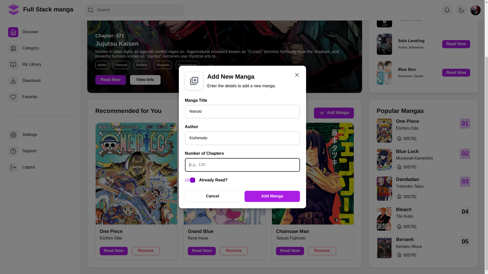

# Full Stack manga

A web-based manga library project developed as part of [The Odin Project's JavaScript course](https://www.theodinproject.com/lessons/node-path-javascript-library#project-solution). This project showcases my understanding of JavaScript objects, prototypes, and DOM manipulation.

## 📚 Overview

The Full Stack Manga Library allows users to manage their manga collection with ease. Users can add new manga, remove existing entries, and toggle the read status of each manga in their collection. The application dynamically updates the display based on user interactions.

## 🛠️ Features

- Add Manga: Easily add new manga entries with details like title, author, chapters, and whether is has been read or not.
- Remove Manga: Delete unwanted manga entries from your library.
- Toggle Read Status: Update the reading status of each manga (e.g., "Read Now" or "Continue").
- Dynamic Rendering: Automatically updates the manga list upon each operation, ensuring a seamless user experience.

## 📈 Future Enhancements

- Add local storage support to save manga entries between sessions.
- Implement search and filter functionality for easier navigation.
- Add sorting options (e.g., by title, author, or reading status).
- Enhance UI/UX with modern design elements.

## 📸 Screenshots

